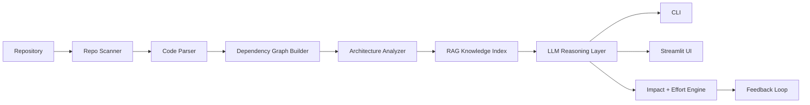
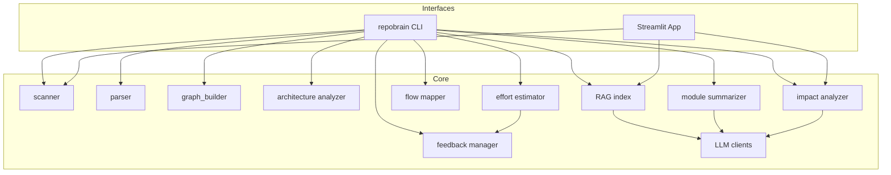
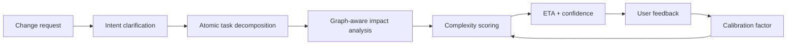

# RepoBrain

<div align="center">

### Local-first AI for understanding codebases, mapping architecture, and estimating change impact

[](#)
[](#)
[](#)
[](#)

</div>

RepoBrain is a local-first repository intelligence system. It scans a codebase, parses structure, builds dependency graphs, detects architectural layers, indexes project knowledge for natural-language Q&A, and estimates the impact and effort of proposed changes.

This repo is meant to be an admiral ship project: not just a script collection, but the foundation of a larger portfolio around developer tooling, code intelligence, and AI-assisted engineering workflows.

## Why RepoBrain

Most repository tools do one slice well: graphing, summarization, search, or chat. RepoBrain tries to connect those into one working analysis pipeline:

- Structural understanding of the repo itself
- Architecture mapping and dependency analysis
- Retrieval-backed repository Q&A
- Change impact analysis
- Effort estimation using a developer-thinking model
- Feedback-driven calibration over time

## What It Does



### Core capabilities

| Capability | What RepoBrain produces |
| --- | --- |
| Repository scanning | Languages, frameworks, entry points, file counts, LOC |
| Code parsing | Functions, classes, imports, comments |
| Graph analysis | Module dependency graph with centrality signals |
| Architecture detection | Heuristic layer classification + Mermaid output |
| Knowledge indexing | Vector-backed retrieval over analyzed code context |
| Natural language Q&A | Answers grounded in repository artifacts |
| Impact analysis | Candidate modules, propagation risk, edit steps |
| Effort estimation | Complexity, ETA range, confidence, risks, unknowns |
| Feedback memory | Repo-specific calibration based on prior estimates |

## Current Shape Of This Repo

RepoBrain currently analyzes itself as a **Python** project with a **Pipeline Architecture** and dual interfaces through **CLI** and **Streamlit UI**.



### Repository layout

```text
repo-brain/
├── repobrain/
│   ├── cli/                # Click-based command-line interface
│   ├── config/             # Config loading
│   ├── src/
│   │   ├── scanner/        # Repo metadata and entry point detection
│   │   ├── parser/         # AST and regex parsing
│   │   ├── graph/          # Dependency graph construction
│   │   ├── architecture/   # Layer and pattern analysis
│   │   ├── summarizer/     # Module summaries and flow mapping
│   │   ├── llm/            # Ollama, OpenAI, RAG index
│   │   ├── impact/         # Change impact analysis
│   │   ├── effort/         # Effort estimation engine
│   │   └── feedback/       # Estimate calibration and feedback memory
│   ├── tests/              # Test suite
│   ├── ui/                 # Streamlit dashboard
│   ├── config.yaml         # Runtime configuration
│   └── pyproject.toml
├── analysis/               # Generated analysis artifacts
├── repobrain_prd.md        # Product direction
└── dev-thinking.md         # Task estimation model
```

## Analysis Outputs

After running analysis, RepoBrain writes machine-readable artifacts into `./analysis`:

| File | Purpose |
| --- | --- |
| `repository_summary.json` | repo inventory, languages, entry points, LOC |
| `parsed_code.json` | extracted structural code data |
| `dependency_graph.graphml` | graph for downstream analysis and UI |
| `architecture_report.json` | pattern, layers, Mermaid diagram |
| `module_summaries.json` | LLM-generated module explanations |
| `impact_report.json` | affected modules and edit plan candidates |
| `effort_estimation.json` | complexity, ETA, confidence, risks |
| `feedback_history.json` | estimate feedback memory |

## Quick Start

### 1. Install

```bash
cd repobrain
pip install -e .
```

### 2. Configure

Edit `repobrain/config.yaml`:

```yaml
llm_provider: local   # local | openai
model: llama3
openai_api_key: ""
openai_model: gpt-4o
ollama_base_url: http://localhost:11434
embedding_model: all-MiniLM-L6-v2
chroma_persist_dir: ./.chroma
analysis_output_dir: ./analysis
```

### 3. Analyze a repository

```bash
repobrain analyze /path/to/repo
```

### 4. Ask questions about the analyzed repo

```bash
repobrain ask "Where is authentication implemented?"
```

### 5. Estimate impact of a change

```bash
repobrain impact "Add Google SSO login"
```

### 6. Feed back on the estimate

```bash
repobrain feedback "this should take much less time"
```

### 7. Launch the UI

```bash
streamlit run repobrain/ui/app.py
```

## CLI Surface

| Command | Description |
| --- | --- |
| `repobrain analyze <repo_path>` | full end-to-end repository analysis |
| `repobrain architecture <repo_path>` | print detected architecture and Mermaid source |
| `repobrain ask "<question>"` | ask grounded questions using indexed context |
| `repobrain impact "<change>"` | estimate change impact and engineering effort |
| `repobrain feedback "<feedback>"` | calibrate future estimates using user feedback |

## UI Experience

The Streamlit app provides six working views:

- `Overview` for repo metrics, languages, frameworks, and entry points
- `Architecture` for detected layers and graph/list views
- `Dependencies` for graph output and centrality ranking
- `Modules` for searchable module summaries
- `Ask` for natural-language questions over indexed context
- `Impact` for effort estimation, risks, scoring breakdown, and feedback-aware calibration

## How The Intelligence Layer Works

### Change evaluation model

RepoBrain does not try to estimate work from gut feel alone. It combines:

- Structural graph signals from the actual repository
- A developer-thinking model from [`dev-thinking.md`](/Users/omerfarukonder/Desktop/Projects/repo-brain/dev-thinking.md)
- LLM interpretation for vague or underspecified requests
- Feedback history that nudges future estimates up or down



### Supported execution modes

| Mode | Best for |
| --- | --- |
| `local` via Ollama | private/local workflows, lower external dependency |
| `openai` | stronger reasoning and summaries when API use is acceptable |

## Example Workflow

```bash
# install
cd repobrain
pip install -e .

# analyze a target repository
repobrain analyze ../some-project

# inspect architecture
repobrain architecture ../some-project

# ask questions
repobrain ask "How does request routing reach the data layer?"

# evaluate a change
repobrain impact "Add audit logging to user deletion"

# calibrate after implementation
repobrain feedback "this estimate was slightly higher than reality"
```

## What Makes This Project Interesting

- It connects static analysis, retrieval, and reasoning instead of treating them as separate demos.
- It treats effort estimation as a first-class product capability.
- It is designed for private-repo workflows with a local-first default.
- It already has both a programmatic pipeline and a human-facing dashboard.
- It can become a platform layer for future repo intelligence products.

## MVP Reality Check

This is a real MVP, not a finished platform. Current strengths and limits:

| Strong today | Still evolving |
| --- | --- |
| End-to-end analysis pipeline | Multi-language depth beyond current parser coverage |
| CLI commands for analyze/ask/impact/feedback | Richer framework detection |
| Streamlit dashboard | More robust graph rendering/export polish |
| Artifact generation in `analysis/` | Broader test coverage across all modules |
| Local-first configuration | Packaging and contributor ergonomics |

## Verification

The current test suite passes with plugin autoload disabled:

```bash
cd repobrain
PYTEST_DISABLE_PLUGIN_AUTOLOAD=1 pytest -q
```

Result at time of writing: `17 passed`.

## Vision

RepoBrain can grow from a repository analysis tool into a broader engineering intelligence system:

- repository onboarding for new engineers
- architecture drift detection
- smarter planning for feature requests
- historical estimation calibration across projects
- AI-native technical due diligence for unfamiliar codebases

## Related project docs

- [`repobrain_prd.md`](/Users/omerfarukonder/Desktop/Projects/repo-brain/repobrain_prd.md)
- [`dev-thinking.md`](/Users/omerfarukonder/Desktop/Projects/repo-brain/dev-thinking.md)

## License

This project is licensed under the MIT License. See [`LICENSE`](/Users/omerfarukonder/Desktop/Projects/repo-brain/LICENSE).
